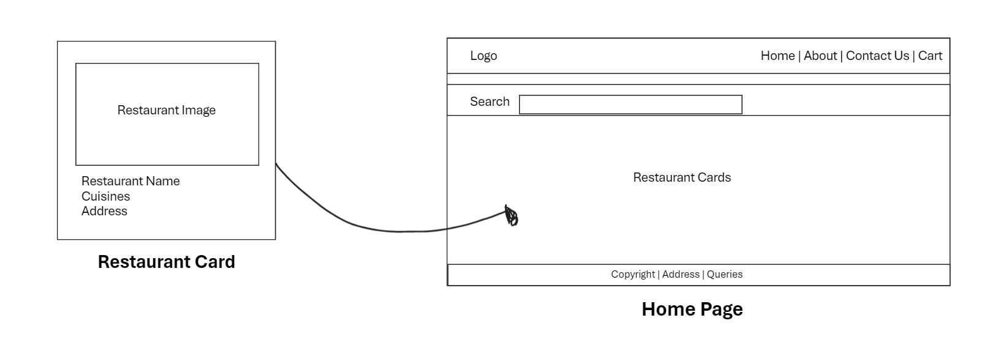

## Food Ordering Application

- This is a food ordering application made using React.
- This application done in the process of learning React.
- For now, this application contains a header and body. The data used for cards in the body is real world data.

### Folder Structure

- public
  - index.html
  - style.css
- src
  - App.js
  - Components
    - Header, Body, and Restaurant card components
- data
  - restaurant data

### Design

### Features to be included

- Search function
- Filter function
- Footer section
- Routing to restaurant's homepage
